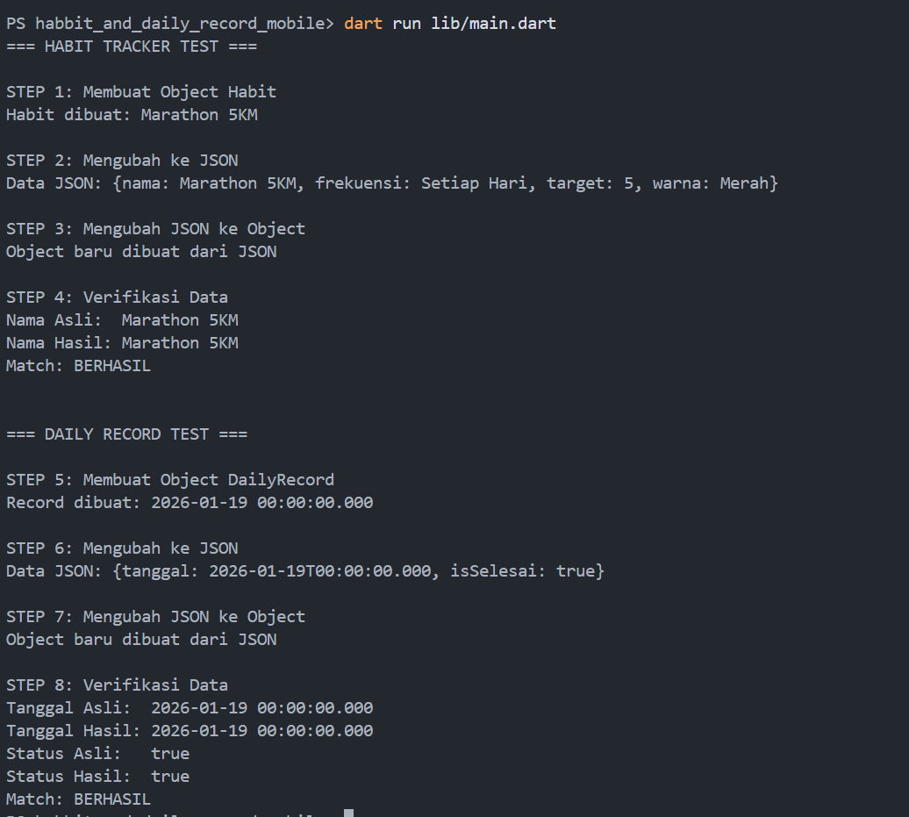

# Mission #4B : Data Modelling - Habbit & Daily Record

Dokumentasi singkat untuk misi data modeling pada aplikasi Habit Tracker.

## Ringkasan

Project ini berfokus pada pembuatan data model `Habit` dan `DailyRecord`,
serta proses serialisasi/deserialisasi JSON di Dart agar data bisa disimpan
atau dikirim ke server dengan format yang konsisten.

## Struktur Singkat

- `lib/models/habit.dart`: Model utama untuk data kebiasaan.
- `lib/models/daily_record.dart`: Model catatan harian.
- `lib/main.dart`: Uji coba serialisasi dan deserialisasi.
- `lib/models/*.g.dart`: File hasil generate `json_serializable` untuk
  helper `toJson()` dan `fromJson()` (jangan diedit manual).

## Penjelasan Setiap Langkah

1. **Membuat Model Data**
   - Menyusun class `Habit` dan `DailyRecord` dengan properti yang relevan.
   - Properti dibuat `final` agar data bersifat immutable.
2. **Menambahkan Serialisasi JSON**
   - Menyediakan `toJson()` untuk mengubah object menjadi `Map`.
   - Menyediakan `fromJson()` untuk membentuk object kembali dari JSON.
   - Proses ini memudahkan penyimpanan lokal maupun komunikasi ke server.
3. **Uji Coba di `main()`**
   - Membuat object contoh `Habit` dan `DailyRecord`.
   - Melakukan serialisasi ke JSON.
   - Melakukan deserialisasi kembali dan membandingkan hasilnya.

## Cara Menjalankan Kode

Pastikan sudah menginstall Flutter (sudah termasuk Dart SDK).

Langkah pertama setelah clone project:

```bash
flutter pub get
```

Setelah dependency terunduh, jalankan dari root project:

```bash
dart run lib/main.dart
```

## Screenshot Output Terminal



## Link GitHub Repository

Tautan repository:

- [https://github.com/fajri-playground/mission_4](https://github.com/fajri-playground/mission_4)
